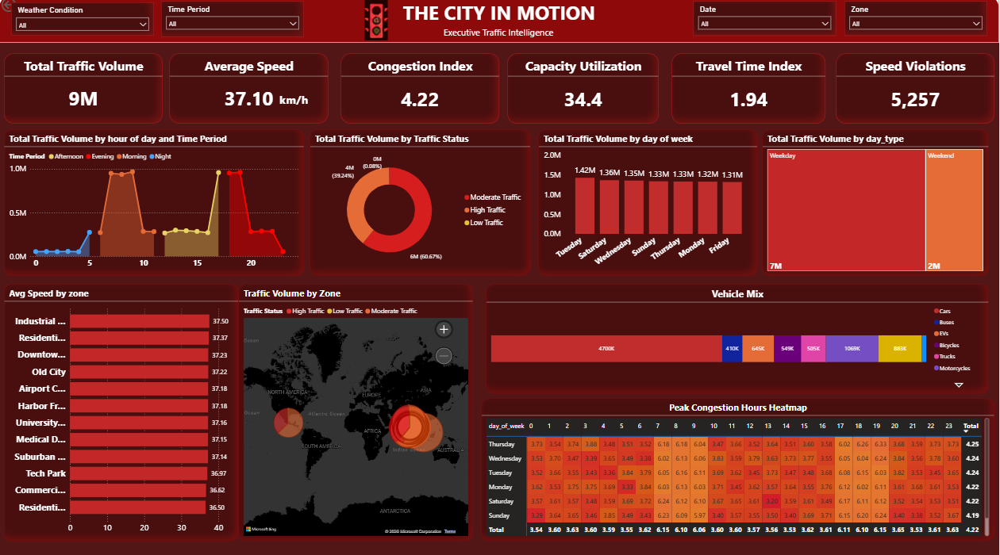
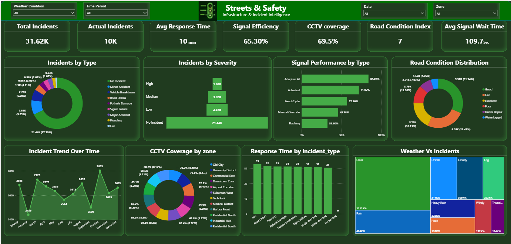
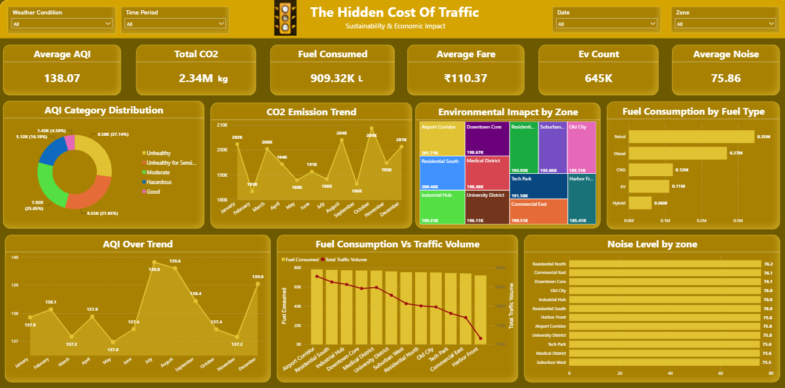

# smart-city-traffic-analysis-powerbi
End-to-end Power BI dashboard analyzing 30,000+ city traffic records using DAX, Power Query, and Data Modeling.
# 🚦 Smart City Traffic Analysis Dashboard

## 📌 Project Overview

This project presents an end-to-end Power BI dashboard built to analyze over **30,000+ hourly traffic records** across multiple city zones.

The dashboard combines:

- Traffic Flow
- Road Safety
- Environmental Metrics

into a unified decision-support system for urban planners and city authorities.

---

# Dashboard Preview

## City In Motion



---

## Streets & Safety



---

## Hidden Cost



---

# Business Problem

Urban traffic congestion affects

- Travel time
- Road safety
- Fuel consumption
- Carbon emissions

The objective was to build an interactive dashboard that identifies congestion hotspots, accident-prone zones, and environmental impacts to support data-driven city planning.

---

# Dataset

The dashboard integrates Three datasets:

- Traffic Flow Data
- Road Safety Data
- Environmental Data

Total Records:

30,000+

---

# Tools Used

- Power BI
- Power Query
- DAX
- Data Modeling
- Excel / CSV

---

# Dashboard Pages

## 1. City In Motion

Shows

- Total Vehicles
- Average Speed
- Congestion Index
- Peak Traffic Hours
- Zone-wise Traffic Volume

---

## 2. Streets & Safety

Shows

- Accident Count
- High-Risk Zones
- Signal Efficiency
- Road Safety Metrics

---

## 3. Hidden Cost

Shows

- CO₂ Emissions
- Air Quality Trends
- Environmental Impact
- Congestion vs Pollution Analysis

---

# Key KPIs

- Total Traffic Volume
- Average Vehicle Speed
- Congestion Index
- Signal Efficiency
- CO₂ Emissions
- Accident Count
- Air Quality Index

---

# DAX Measures

Created **20+ custom DAX measures**

# Features

- Interactive Filters
- Drill-down Reports
- Date Hierarchy
- Time Intelligence
- Dynamic KPI Cards
- Cross Filtering
- Responsive Visualizations

---

# Insights

- Peak congestion occurs during morning and evening rush hours.
- Certain city zones consistently experience higher traffic density.
- Increased traffic volume is strongly associated with higher CO₂ emissions.
- Low signal efficiency contributes to localized congestion hotspots.
- Accident frequency is higher in heavily congested intersections.

---

# Skills Demonstrated

- Data Cleaning
- Power Query
- Data Modeling
- Star Schema
- DAX
- KPI Design
- Dashboard Design
- Data Visualization
- Business Intelligence

---

# Repository Structure

```
Dashboard/
Dataset/
Images/
README.md
```

---

# Author

Dejaswini


GitHub:
github.com/Dejas-Nandha
